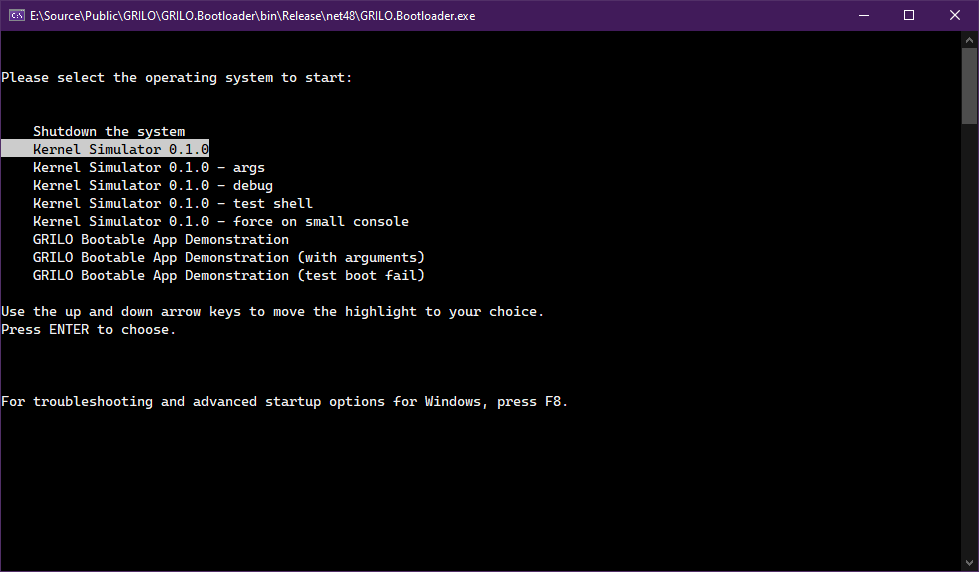

# 👋 Welcome!

<figure><figcaption></figcaption></figure>

GRILO is a bootloader simulator that can execute any .NET console application supported by the GRILO interface. It simulates the boot process of GRUB/LILO by showing the boot menu and displaying pre-boot messages.

It's just a simulator, so you can't boot this bootloader from your real computer; it's just like any other application installed on your computer that **simulates** how the bootloader works.

## This documentation

To get started, select a page on the left edge of the screen to get started.
